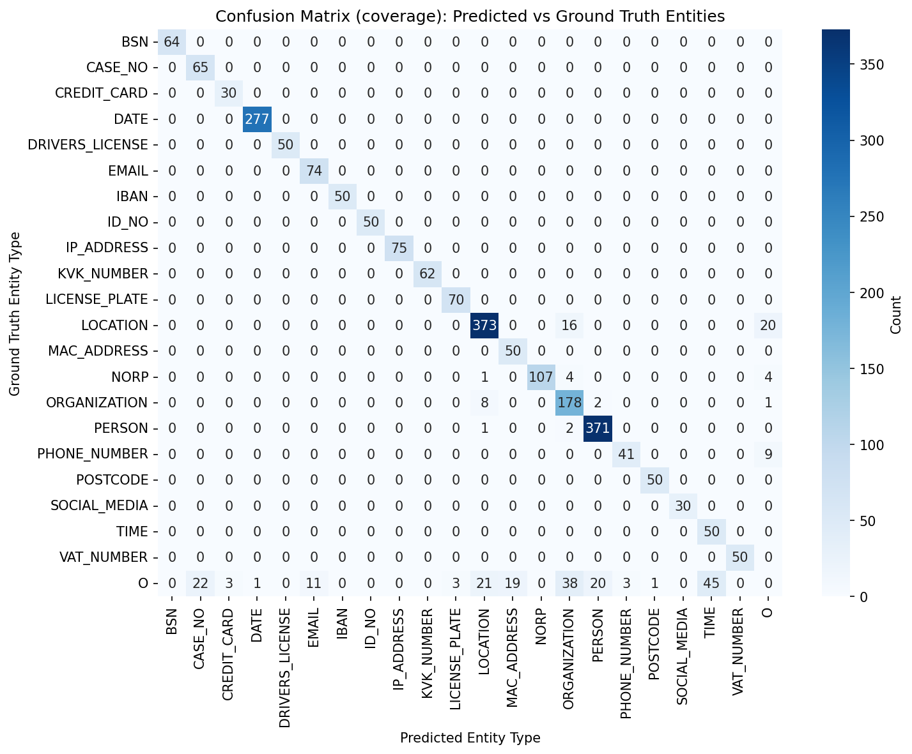
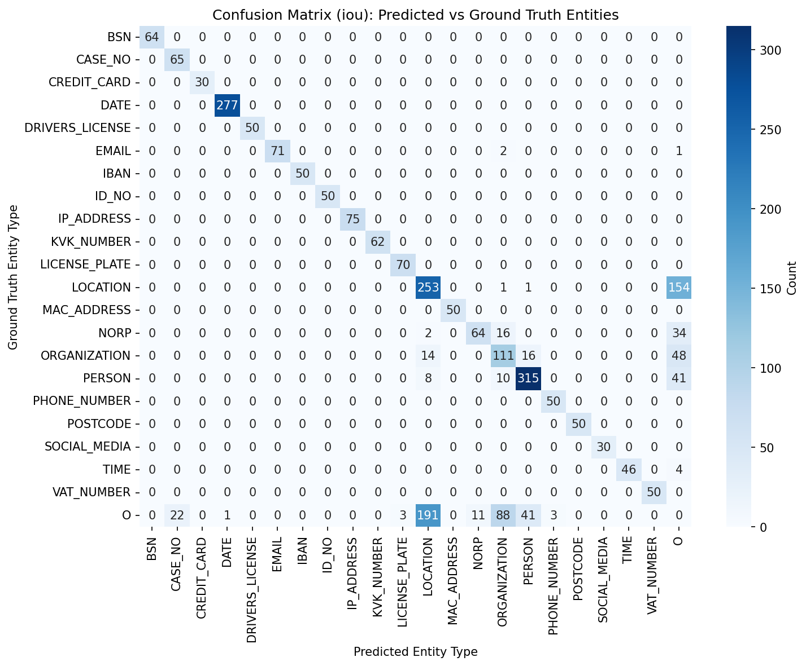

# spaCy vs GLiNER benchmark vergelijking

## Resultaten (juni 2026)

### Globale Metrieken

| Model | Precision | Recall | F1-Score |
|-------|-----------|--------|----------|
| **GLiNER** | 0.907 | 0.970 | 0.937 |
| **spaCy** | 0.814 | 0.843 | 0.828 |

GLiNER scoort aanzienlijk beter dan spaCy op alle globale metrieken, met name op precision (+9,3%) en recall (+12,7%).

### Entity-level vergelijking

#### Sterke punten GLiNER:
- **LOCATION**: F1 0.92 vs 0.58 (spaCy) – GLiNER detecteert locaties veel nauwkeuriger met minder false positives (31 FP vs 215 FP)
- **PERSON**: F1 0.97 vs 0.84 – GLiNER heeft betere precisie (0.94 vs 0.84) en recall (0.99 vs 0.84)
- **ORGANIZATION**: F1 0.83 vs 0.53 – GLiNER heeft significant minder false positives (60 vs 117)
- **EMAIL**: F1 0.93 vs 0.98 –spaCy scoort hier iets beter
- **NORP**: F1 0.96 vs 0.67 – GLiNER herkent nationaliteiten/religies veel beter

### Belangrijkste Verschillen

#### False Positives:
- **GLiNER**: 247 totale FP, voornamelijk bij TIME (45), ORGANIZATION (38), en LOCATION (21)
- **spaCy**: 340 totale FP, met name LOCATION (191), ORGANIZATION (88), en PERSON (41)
- spaCy produceert ~37% meer false positives dan GLiNER

#### False Negatives:
- **GLiNER**: 68 totale FN, voornamelijk LOCATION (36), PHONE_NUMBER (9), NORP (9)
- **spaCy**: 286 totale FN, met name LOCATION (156), NORP (52), ORGANIZATION (78), PERSON (59)
- GLiNER mist ~76% minder entities dan spaCy

### Confusion Matrices

##### GLiNER + custom pattern recognizers

##### spaCy + custom pattern recognizers

### Conclusie

GLiNER overtreft spaCy op vrijwel alle metrieken voor Nederlandstalige PII NER. De grootste verbeteringen zijn:
- **Betere precisie**: GLiNER is conservatiever en produceert minder false positives
- **Hogere recall**: GLiNER detecteert meer relevante entities
- **Betere contextuele understanding**: GLiNER onderscheidt beter tussen entities en gewone tekst (bijv. "woongebied" vs echte locaties)
